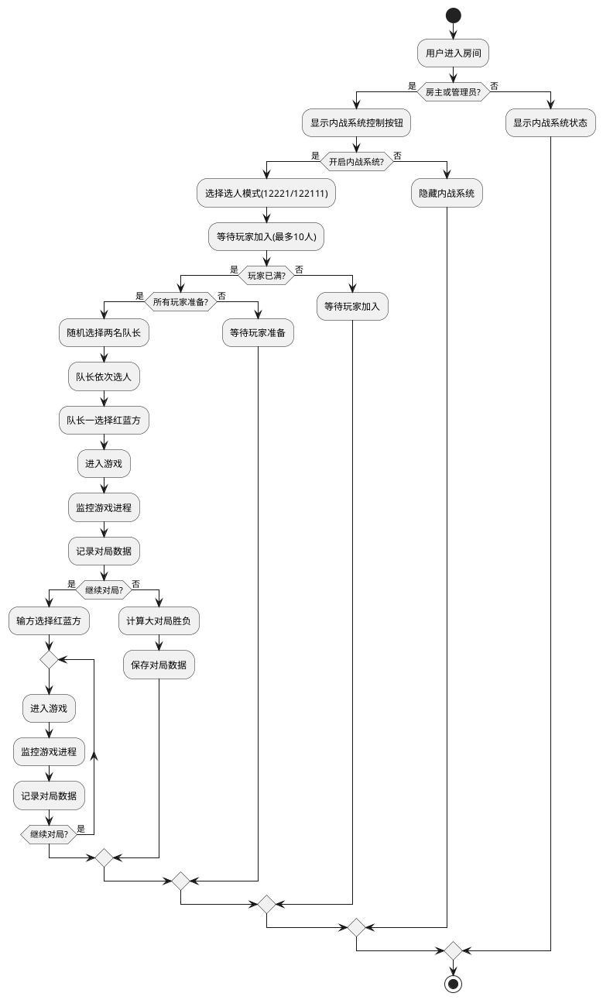

# 英雄联盟内战助手需求文档

## 1. 系统概述

### 1.1 项目背景
开发一个类似YY语音的Windows桌面应用，专门用于英雄联盟内战组织和管理。系统提供房间管理、语音聊天、文字聊天、内战系统等功能。系统通过LCU API与英雄联盟客户端进行交互，实现实时数据获取和状态监控。

### 1.2 目标用户
- 英雄联盟玩家
- 战队/俱乐部
- 游戏社区管理员

### 1.3 LCU API说明

#### 1.3.1 API概述
LCU (League Client Update) API是英雄联盟客户端提供的本地API接口，允许第三方应用与客户端进行交互。API通过WebSocket和HTTP接口提供服务。

#### 1.3.2 认证方式
```json
{
  "auth": {
    "username": "riot",
    "password": "自动生成的令牌",
    "port": "客户端端口号"
  }
}
```

#### 1.3.3 主要API端点
1. 玩家信息
   - `GET /lol-summoner/v1/current-summoner` - 获取当前玩家信息
   - `GET /lol-summoner/v1/summoners/{summonerId}` - 获取指定玩家信息
   - `GET /lol-summoner/v1/summoners/by-riot-id/{gameName}/{tagLine}` - 通过Riot ID获取玩家信息

2. 排位信息
   - `GET /lol-ranked/v1/current-ranked-stats` - 获取当前排位信息
   - `GET /lol-ranked/v1/ranked-stats/{puuid}` - 获取指定玩家排位信息

3. 对局信息
   - `GET /lol-match-history/v1/products/lol/{puuid}/matches` - 获取玩家对局历史
   - `GET /lol-match-history/v1/games/{gameId}` - 获取对局详情
   - `GET /lol-gameflow/v1/session` - 获取当前游戏状态
   - `GET /lol-gameflow/v1/gameflow-phase` - 获取游戏阶段
   - `GET /lol-gameflow/v1/active-player` - 获取当前玩家信息
   - `GET /lol-gameflow/v1/active-player/runes` - 获取当前玩家符文
   - `GET /lol-gameflow/v1/active-player/summoner-spells` - 获取当前玩家召唤师技能
   - `GET /lol-gameflow/v1/active-player/selected-champion` - 获取当前玩家选择的英雄
   - `GET /lol-gameflow/v1/active-player/selected-skin` - 获取当前玩家选择的皮肤
   - `GET /lol-gameflow/v1/active-player/selected-position` - 获取当前玩家选择的位置
   - `GET /lol-gameflow/v1/active-player/selected-role` - 获取当前玩家选择的角色
   - `GET /lol-gameflow/v1/active-player/selected-team` - 获取当前玩家选择的队伍
   - `GET /lol-gameflow/v1/active-player/selected-summoner-spells` - 获取当前玩家选择的召唤师技能
   - `GET /lol-gameflow/v1/active-player/selected-runes` - 获取当前玩家选择的符文
   - `GET /lol-gameflow/v1/active-player/selected-champion-skin` - 获取当前玩家选择的英雄皮肤
   - `GET /lol-gameflow/v1/active-player/selected-champion-position` - 获取当前玩家选择的英雄位置
   - `GET /lol-gameflow/v1/active-player/selected-champion-role` - 获取当前玩家选择的英雄角色
   - `GET /lol-gameflow/v1/active-player/selected-champion-team` - 获取当前玩家选择的英雄队伍
   - `GET /lol-gameflow/v1/active-player/selected-champion-summoner-spells` - 获取当前玩家选择的英雄召唤师技能
   - `GET /lol-gameflow/v1/active-player/selected-champion-runes` - 获取当前玩家选择的英雄符文

4. 英雄信息
   - `GET /lol-champions/v1/owned-champions` - 获取已拥有英雄
   - `GET /lol-champions/v1/champions/{championId}` - 获取英雄详情

5. 客户端状态
   - `GET /lol-gameflow/v1/gameflow-phase` - 获取客户端状态
   - `GET /lol-gameflow/v1/availability` - 获取可用性状态

#### 1.3.4 API调用示例
```python
# 获取当前玩家信息
async def get_current_summoner():
    url = f"https://127.0.0.1:{port}/lol-summoner/v1/current-summoner"
    headers = {
        "Authorization": f"Basic {auth_token}",
        "Accept": "application/json"
    }
    async with aiohttp.ClientSession() as session:
        async with session.get(url, headers=headers, ssl=False) as response:
            return await response.json()

# 获取对局历史
async def get_match_history(puuid):
    url = f"https://127.0.0.1:{port}/lol-match-history/v1/products/lol/{puuid}/matches"
    headers = {
        "Authorization": f"Basic {auth_token}",
        "Accept": "application/json"
    }
    async with aiohttp.ClientSession() as session:
        async with session.get(url, headers=headers, ssl=False) as response:
            return await response.json()

# 获取当前对局信息
async def get_current_game():
    url = f"https://127.0.0.1:{port}/lol-gameflow/v1/session"
    headers = {
        "Authorization": f"Basic {auth_token}",
        "Accept": "application/json"
    }
    async with aiohttp.ClientSession() as session:
        async with session.get(url, headers=headers, ssl=False) as response:
            return await response.json()

# 获取当前玩家选择的英雄信息
async def get_current_champion():
    url = f"https://127.0.0.1:{port}/lol-gameflow/v1/active-player/selected-champion"
    headers = {
        "Authorization": f"Basic {auth_token}",
        "Accept": "application/json"
    }
    async with aiohttp.ClientSession() as session:
        async with session.get(url, headers=headers, ssl=False) as response:
            return await response.json()
```

## 2. 界面设计

### 2.1 主界面布局
```
+------------------------------------------+
|  LOGO  |  搜索框  |  设置  |  主题切换  |
+------------------------------------------+
| 主页  | 好友  | 群组  | 房间  | 消息  |
+------------------------------------------+
```

### 2.2 主页界面
```
+------------------------------------------+
| 我的房间                                 |
| ├─ 房间1                                |
| ├─ 房间2                                |
| └─ 房间3                                |
|                                         |
| 我的收藏                                |
| ├─ 收藏房间1                            |
| └─ 收藏房间2                            |
|                                         |
| 最近访问                                |
| ├─ 最近房间1                            |
| └─ 最近房间2                            |
+------------------------------------------+
```

### 2.3 好友界面
```
+------------------------------------------+
| 在线好友                                 |
| ├─ 好友1 [游戏中]                       |
| ├─ 好友2 [在线]                         |
| └─ 好友3 [在线]                         |
|                                         |
| 离线好友                                |
| ├─ 好友4                                |
| └─ 好友5                                |
+------------------------------------------+
```

### 2.4 群组界面
```
+------------------------------------------+
| 我创建的群                               |
| ├─ 群组1                                |
| └─ 群组2                                |
|                                         |
| 我加入的群                              |
| ├─ 群组3                                |
| ├─ 群组4                                |
| └─ 群组5                                |
+------------------------------------------+
```

### 2.5 房间创建界面
```
+------------------------------------------+
| 创建新房间                               |
+------------------------------------------+
| 房间名称：[____________]                 |
| 游戏类型：[英雄联盟▼]                   |
| 房间密码：[____________]                 |
| 房间描述：                               |
| [                    ]                   |
| [                    ]                   |
|                                         |
| [取消]            [创建房间]            |
+------------------------------------------+
```

### 2.6 房间界面（基础状态）
```
+------------------------------------------+
| 房间名称 | 房主信息 | 战绩查询 | 设置 | 关闭按钮 |
+------------------------------------------+
| 语音频道列表    |  房间功能区域          |
| ├─ 主频道       |  +------------------+  |
| ├─ 频道1        |  | 内战系统状态     |  |
| └─ 频道2        |  | [开启内战系统]   |  |
|                 |  +------------------+  |
|                 |                        |
|                 |  文字聊天区域          |
|                 |  +------------------+  |
|                 |  | 聊天消息列表     |  |
|                 |  |                  |  |
|                 |  |                  |  |
|                 |  +------------------+  |
|                 |  | 输入框 | 发送    |  |
|                 |  +------------------+  |
+------------------------------------------+
```

[LCU API调用：获取当前玩家信息、房间状态]

### 2.7 房间界面（内战系统开启状态）
```
+------------------------------------------+
| 房间名称 | 房主信息 | 战绩查询 | 设置 | 关闭按钮 |
+------------------------------------------+
| 语音频道列表    |  内战系统区域          |
| ├─ 主频道       |  +------------------+  |
| ├─ 蓝队频道     |  | 内战系统状态     |  |
| └─ 红队频道     |  | [步骤指示器]     |  |
|                 |  +------------------+  |
| 当前在线成员    |  | 内战系统主界面   |  |
| ├─ 玩家1        |  |                  |  |
| ├─ 玩家2        |  |                  |  |
| ├─ 玩家3        |  |                  |  |
| ├─ 玩家4        |  |                  |  |
| └─ ...          |  |                  |  |
|                 |  +------------------+  |
|                 |                        |
|                 |  文字聊天区域(迷你)    |
|                 |  +------------------+  |
|                 |  | 聊天消息         |  |
|                 |  +------------------+  |
|                 |  | 输入框 | 发送    |  |
|                 |  +------------------+  |
+------------------------------------------+
```

[LCU API调用：获取当前玩家信息、房间状态、游戏状态]

### 2.8 内战系统界面流程

#### 2.8.1 步骤一：准备环节（集成在房间界面内）
```
+------------------------------------------+
| 内战系统 - 准备环节                      |
+------------------------------------------+
| 选人模式：[12221▼]                      |
|                                         |
| 玩家列表（0/10）                        |
| +-----------------------------------+   |
| |                                   |   |
| | [加入对局]                        |   |
| |                                   |   |
| +-----------------------------------+   |
|                                         |
| [关闭内战系统]        [全部准备完成]    |
+------------------------------------------+
```

[LCU API调用：获取玩家状态、游戏可用性]

#### 2.8.2 步骤二：选人环节（集成在房间界面内）
```
+------------------------------------------+
| 内战系统 - 选人环节                      |
+------------------------------------------+
| 队长一：玩家名称                         |
| 队长二：玩家名称                         |
|                                         |
| 待选玩家                                |
| +-----------------------------------+   |
| | □ 玩家1    □ 玩家2    □ 玩家3    |   |
| | □ 玩家4    □ 玩家5    □ 玩家6    |   |
| | □ 玩家7    □ 玩家8                |   |
| +-----------------------------------+   |
|                                         |
| 队伍一：                                |
| - 队长一                                |
| - [待选择]                              |
| - [待选择]                              |
| - [待选择]                              |
| - [待选择]                              |
|                                         |
| 队伍二：                                |
| - 队长二                                |
| - [待选择]                              |
| - [待选择]                              |
| - [待选择]                              |
| - [待选择]                              |
|                                         |
| [返回]              [确认选择]          |
+------------------------------------------+
```

#### 2.8.3 步骤三：选择红蓝方（集成在房间界面内）
```
+------------------------------------------+
| 内战系统 - 选择红蓝方                    |
+------------------------------------------+
| 队伍一                    队伍二          |
| 队长：玩家名称           队长：玩家名称   |
| 队员：玩家1              队员：玩家5      |
| 队员：玩家2              队员：玩家6      |
| 队员：玩家3              队员：玩家7      |
| 队员：玩家4              队员：玩家8      |
|                                         |
| [选择蓝方]              [选择红方]      |
+------------------------------------------+
```

#### 2.8.4 步骤四：对局详情界面（集成在房间界面内）
```
+------------------------------------------+
| 内战系统 - 对局详情                      |
+------------------------------------------+
| 蓝方                     红方            |
| +----------------+      +----------------+|
| |玩家1 [选择中]  |      |玩家6 [锁定英雄]||
| |玩家2 [禁用中]  |      |玩家7 [选择中] ||
| |玩家3 [等待中]  |      |玩家8 [禁用中] ||
| |玩家4 [等待中]  |      |玩家9 [等待中] ||
| |玩家5 [等待中]  |      |玩家10[等待中] ||
| +----------------+      +----------------+|
|                                         |
| 禁用英雄：                              |
| [英雄1] [英雄2] [英雄3] [英雄4] [英雄5] |
| [英雄6] [英雄7] [英雄8] [英雄9] [英雄10]|
|                                         |
| [刷新状态]                              |
+------------------------------------------+
```

[LCU API调用：获取游戏状态、英雄选择状态、禁用英雄列表]

#### 2.8.5 步骤五：对局结果界面（集成在房间界面内）
```
+------------------------------------------+
| 内战系统 - 对局结果                      |
+------------------------------------------+
| 胜利方：蓝队                            |
|                                         |
| 蓝方数据                                |
| 玩家1：10/2/8 英雄名称                  |
| 玩家2：8/3/12 英雄名称                  |
| 玩家3：5/4/15 英雄名称                  |
| 玩家4：3/5/20 英雄名称                  |
| 玩家5：12/1/6 英雄名称                  |
|                                         |
| 红方数据                                |
| 玩家6：4/8/10 英雄名称                  |
| 玩家7：2/10/8 英雄名称                  |
| 玩家8：6/7/9 英雄名称                   |
| 玩家9：1/9/12 英雄名称                  |
| 玩家10：5/4/7 英雄名称                  |
|                                         |
| [继续对局]            [结束对局]        |
+------------------------------------------+
```

### 2.9 历史对局查询界面（弹出窗口）
```
+------------------------------------------+
| 房间历史对局                             |
+------------------------------------------+
| 筛选：[日期▼] [玩家▼] [胜负▼]          |
|                                         |
| 对局列表：                              |
| +-----------------------------------+   |
| | 2024-01-01 20:30                  |   |
| | 蓝队 VS 红队                      |   |
| | 胜利方：蓝队                      |   |
| | [详情]                            |   |
| +-----------------------------------+   |
| | 2024-01-01 19:00                  |   |
| | 蓝队 VS 红队                      |   |
| | 胜利方：红队                      |   |
| | [详情]                            |   |
| +-----------------------------------+   |
|                                         |
| 统计数据：                              |
| - 总场次：20                           |
| - 最高胜率玩家：玩家1 (80%)            |
| - 最佳搭档：玩家2 + 玩家3 (85%)        |
|                                         |
| [关闭]                                 |
+------------------------------------------+
```

[LCU API调用：获取历史对局数据、玩家统计数据]

## 3. 功能流程

### 3.1 内战系统流程图


## 4. 数据模型

### 4.1 房间数据模型
```json
{
  "$schema": "http://json-schema.org/draft-07/schema#",
  "type": "object",
  "properties": {
    "roomId": {
      "type": "string",
      "description": "房间唯一标识"
    },
    "roomName": {
      "type": "string",
      "description": "房间名称"
    },
    "roomType": {
      "type": "string",
      "enum": ["LOL"],
      "description": "游戏类型"
    },
    "password": {
      "type": "string",
      "description": "房间密码"
    },
    "description": {
      "type": "string",
      "description": "房间描述"
    },
    "owner": {
      "type": "string",
      "description": "房主ID"
    },
    "admins": {
      "type": "array",
      "items": {
        "type": "string"
      },
      "description": "管理员ID列表"
    },
    "voiceChannels": {
      "type": "array",
      "items": {
        "type": "object",
        "properties": {
          "channelId": {
            "type": "string"
          },
          "channelName": {
            "type": "string"
          },
          "members": {
            "type": "array",
            "items": {
              "type": "string"
            }
          }
        }
      }
    }
  }
}
```

### 4.2 内战系统数据模型
```json
{
  "$schema": "http://json-schema.org/draft-07/schema#",
  "type": "object",
  "properties": {
    "warId": {
      "type": "string",
      "description": "内战唯一标识"
    },
    "roomId": {
      "type": "string",
      "description": "所属房间ID"
    },
    "status": {
      "type": "string",
      "enum": ["准备中", "选人中", "选边中", "游戏中", "已结束"],
      "description": "内战状态"
    },
    "pickMode": {
      "type": "string",
      "enum": ["12221", "122111"],
      "description": "选人模式"
    },
    "players": {
      "type": "array",
      "items": {
        "type": "object",
        "properties": {
          "userId": {
            "type": "string",
            "description": "玩家ID，通过LCU API获取"
          },
          "userName": {
            "type": "string",
            "description": "玩家名称，通过LCU API获取"
          },
          "ready": {
            "type": "boolean",
            "description": "准备状态，通过LCU API监控"
          },
          "team": {
            "type": "integer",
            "enum": [1, 2]
          },
          "isCaptain": {
            "type": "boolean"
          }
        }
      },
      "maxItems": 10
    },
    "games": {
      "type": "array",
      "items": {
        "type": "object",
        "properties": {
          "gameId": {
            "type": "string",
            "description": "游戏ID，通过LCU API获取"
          },
          "startTime": {
            "type": "string",
            "format": "date-time"
          },
          "endTime": {
            "type": "string",
            "format": "date-time"
          },
          "team1": {
            "type": "object",
            "properties": {
              "side": {
                "type": "string",
                "enum": ["red", "blue"]
              },
              "players": {
                "type": "array",
                "items": {
                  "type": "object",
                  "properties": {
                    "userId": {
                      "type": "string"
                    },
                    "champion": {
                      "type": "string",
                      "description": "英雄ID，通过LCU API获取"
                    },
                    "kills": {
                      "type": "integer",
                      "description": "击杀数，通过LCU API获取"
                    },
                    "deaths": {
                      "type": "integer",
                      "description": "死亡数，通过LCU API获取"
                    },
                    "assists": {
                      "type": "integer",
                      "description": "助攻数，通过LCU API获取"
                    }
                  }
                }
              }
            }
          },
          "team2": {
            "type": "object",
            "properties": {
              "side": {
                "type": "string",
                "enum": ["red", "blue"]
              },
              "players": {
                "type": "array",
                "items": {
                  "type": "object",
                  "properties": {
                    "userId": {
                      "type": "string"
                    },
                    "champion": {
                      "type": "string",
                      "description": "英雄ID，通过LCU API获取"
                    },
                    "kills": {
                      "type": "integer",
                      "description": "击杀数，通过LCU API获取"
                    },
                    "deaths": {
                      "type": "integer",
                      "description": "死亡数，通过LCU API获取"
                    },
                    "assists": {
                      "type": "integer",
                      "description": "助攻数，通过LCU API获取"
                    }
                  }
                }
              }
            }
          },
          "winner": {
            "type": "integer",
            "enum": [1, 2]
          }
        }
      }
    }
  }
}
```

## 5. 主题设计

### 5.1 简洁毛玻璃主题（默认）
- 主色调：蓝白银
- 背景：半透明毛玻璃效果
- 元素特点：
  - 圆角设计
  - 浅色阴影
  - 高斯模糊背景
  - 扁平化图标
  - 简约线条

配色方案：
```css
{
  --primary-color: #4A90E2;
  --secondary-color: #F8F9FA;
  --accent-color: #E2E8F0;
  --text-primary: #2D3748;
  --text-secondary: #718096;
  --background: rgba(255, 255, 255, 0.8);
  --glass-effect: blur(10px);
}
```

### 5.2 暗黑科技主题
- 主色调：紫蓝黑
- 背景：3D科技感纹理
- 元素特点：
  - 霓虹边缘效果
  - 深色磨砂质感
  - 科技感线条装饰
  - 立体感按钮
  - 动态光效

配色方案：
```css
{
  --primary-color: #6B46C1;
  --secondary-color: #1A202C;
  --accent-color: #4299E1;
  --text-primary: #E2E8F0;
  --text-secondary: #A0AEC0;
  --background: rgba(26, 32, 44, 0.95);
  --neon-effect: 0 0 10px #4299E1;
}
```

## 6. 交互流程

### 6.1 房间创建流程
1. 点击"创建房间"按钮
2. 弹出创建房间表单
3. 填写房间信息：
   - 房间名称（必填）
   - 游戏类型（默认：英雄联盟）
   - 房间密码（可选）
   - 房间描述（可选）
4. 点击确认创建
5. 系统自动进入新创建的房间

### 6.2 内战系统操作流程
1. 房主/管理员开启内战系统
2. 选择选人模式（12221/122111）
3. 等待玩家加入并准备
4. 系统随机选择队长
5. 队长轮流选择队友
6. 选择红蓝方
7. 进入游戏
8. 游戏结束后选择继续或结束

## 7. 数据统计功能

### 7.1 个人数据统计
- 总场次
- 胜率
- 平均KDA
- 常用英雄
- 最佳搭档
- 最差搭档

### 7.2 房间数据统计
- 总对局数
- 活跃度排名
- 胜率最高玩家
- 最佳组合
- 最近对局记录

## 8. LCU API集成说明

### 8.1 认证流程
1. 获取客户端端口号和认证令牌
   - 读取`lockfile`文件获取端口号和令牌
   - 或通过进程监控获取客户端信息

2. 建立WebSocket连接
   - 连接到`wss://127.0.0.1:{port}`
   - 使用Basic认证

3. 监控客户端状态
   - 监听`/lol-gameflow/v1/gameflow-phase`事件
   - 处理客户端状态变化

### 8.2 数据同步
1. 玩家信息同步
   - 定期更新玩家状态
   - 监控玩家在线状态
   - 获取玩家排位信息

2. 对局信息同步
   - 监控游戏开始/结束
   - 获取对局详情
   - 记录KDA数据

3. 英雄选择同步
   - 监控英雄选择状态
   - 获取禁用英雄列表
   - 更新选择结果

### 8.3 错误处理
1. 连接错误
   - 客户端未启动
   - 认证失败
   - 连接超时

2. 数据错误
   - 数据格式错误
   - 数据缺失
   - 数据不一致

3. 状态错误
   - 客户端状态异常
   - 游戏状态异常
   - 玩家状态异常

### 8.4 安全考虑
1. 本地通信
   - 仅允许本地连接
   - 使用HTTPS/WebSocket
   - 验证认证信息

2. 数据保护
   - 加密敏感信息
   - 限制数据访问
   - 定期清理缓存

3. 权限控制
   - 最小权限原则
   - 操作验证
   - 日志记录

## 9. 开发环境与项目结构

### 9.1 开发语言与框架
- **前端**：
  - **主要语言**：JavaScript/TypeScript
  - **UI框架**：React
  - **桌面应用封装**：Electron
  - **UI组件库**：Ant Design 或 Material-UI
  - **状态管理**：Redux 或 Zustand
  - **样式方案**：Styled-components 或 Tailwind CSS
  - **实时通信**：Socket.IO

- **后端**：
  - **主要语言**：Go
  - **Web框架**：Gin 或 Echo
  - **WebSocket**：Gorilla WebSocket
  - **数据库**：SQLite 或 MongoDB
  - **音频处理**：WebRTC

### 9.2 开发环境配置
1. **前端环境**
   - Node.js 16.x 或更高版本
   - npm 或 yarn 包管理器
   - TypeScript 4.x 或更高版本

2. **后端环境**
   - Go 1.18 或更高版本
   - Go模块管理

3. **IDE推荐**
   - Visual Studio Code + React/TypeScript/Go插件
   - GoLand（Go开发）
   - WebStorm（React开发）

4. **前端依赖管理**
   ```json
   {
     "dependencies": {
       "react": "^18.2.0",
       "react-dom": "^18.2.0",
       "electron": "^22.0.0",
       "antd": "^5.0.0",
       "styled-components": "^5.3.6",
       "redux": "^4.2.0",
       "react-redux": "^8.0.5",
       "socket.io-client": "^4.5.4",
       "axios": "^1.2.0",
       "react-router-dom": "^6.4.3"
     }
   }
   ```

5. **后端依赖管理**
   ```go
   // go.mod
   module github.com/yourusername/lol-war-assistant

   go 1.18

   require (
     github.com/gin-gonic/gin v1.8.1
     github.com/gorilla/websocket v1.5.0
     github.com/mattn/go-sqlite3 v1.14.16
     github.com/spf13/viper v1.14.0
   )
   ```

6. **调试工具**
   - Chrome DevTools（前端调试）
   - Delve（Go调试器）
   - Postman（API测试）
   - Fiddler/Charles（网络请求监控）

### 9.3 项目结构
```
lol-war-assistant/
├── frontend/                    # 前端React应用
│   ├── public/                  # 静态资源
│   ├── src/
│   │   ├── components/          # UI组件
│   │   │   ├── Room/            # 房间相关组件
│   │   │   ├── War/             # 内战系统组件
│   │   │   ├── Voice/           # 语音聊天组件
│   │   │   └── Stats/           # 数据统计组件
│   │   ├── pages/               # 页面组件
│   │   ├── services/            # 前端服务
│   │   ├── store/               # 状态管理
│   │   ├── hooks/               # 自定义Hooks
│   │   ├── utils/               # 工具函数
│   │   ├── themes/              # 主题配置
│   │   └── App.tsx              # 应用入口
│   ├── electron/                # Electron配置
│   └── package.json             # 依赖配置
│
├── backend/                     # Go后端
│   ├── cmd/                     # 入口命令
│   │   └── server/              # 服务器入口
│   ├── internal/                # 内部包
│   │   ├── api/                 # API路由
│   │   ├── lcu/                 # LCU API交互
│   │   ├── models/              # 数据模型
│   │   ├── services/            # 业务逻辑
│   │   ├── store/               # 数据存储
│   │   └── websocket/           # WebSocket服务
│   ├── pkg/                     # 公共包
│   │   ├── config/              # 配置
│   │   └── utils/               # 工具函数
│   ├── go.mod                   # Go模块定义
│   └── go.sum                   # 依赖版本锁定
│
├── assets/                      # 共享资源
│   ├── icons/                   # 图标
│   ├── sounds/                  # 音效
│   └── themes/                  # 主题资源
│
├── tests/                       # 测试代码
│   ├── frontend/                # 前端测试
│   │   ├── components/          # 组件测试
│   │   └── services/            # 服务测试
│   └── backend/                 # 后端测试
│       ├── api/                 # API测试
│       └── lcu/                 # LCU交互测试
│
├── docs/                        # 文档
│   ├── api/                     # API文档
│   └── user/                    # 用户文档
│
├── scripts/                     # 构建脚本
│   ├── build.sh                 # 构建脚本
│   └── deploy.sh                # 部署脚本
│
├── .gitignore                   # Git忽略文件
├── README.md                    # 项目说明
└── docker-compose.yml           # Docker配置
```

### 9.4 开发最佳实践
1. **代码风格**
   - 遵循PEP 8编码规范
   - 使用mypy进行类型检查
   - 使用pylint/flake8进行代码质量检查

2. **UI设计**
   - 使用Qt Designer设计UI
   - UI与逻辑分离，遵循MVC/MVVM模式
   - 使用QSS实现主题切换

3. **异步处理**
   - 使用asyncio进行异步操作
   - 与Qt事件循环集成使用qasync
   - 避免阻塞主线程

4. **错误处理**
   - 全局异常捕获
   - 结构化日志记录
   - 用户友好的错误提示

5. **测试策略**
   - 单元测试：pytest
   - 模拟测试：unittest.mock
   - UI测试：PyQt Test

6. **资源管理**
   - 懒加载资源
   - 缓存机制
   - 内存优化

### 9.5 开发工作流程
1. **初始化**
   - 克隆仓库
   - 创建虚拟环境
   - 安装依赖

2. **开发**
   - 编写单元测试
   - 实现功能
   - 验证测试通过

3. **构建与测试**
   - 使用pyinstaller打包
   - 测试安装包
   - 验证各功能正常

4. **部署**
   - 生成安装包
   - 发布更新
   - 收集用户反馈

### 9.6 实现难点与解决方案
1. **API认证**
   - 难点：获取认证令牌
   - 解决方案：监控lockfile文件或使用进程监控

2. **实时音频通信**
   - 难点：低延迟音频传输
   - 解决方案：使用UDP协议，适当降低音频质量

3. **界面响应性**
   - 难点：保持UI流畅
   - 解决方案：异步操作，避免阻塞主线程

4. **多用户数据同步**
   - 难点：保证数据一致性
   - 解决方案：使用WebSocket实时同步，定期校验
